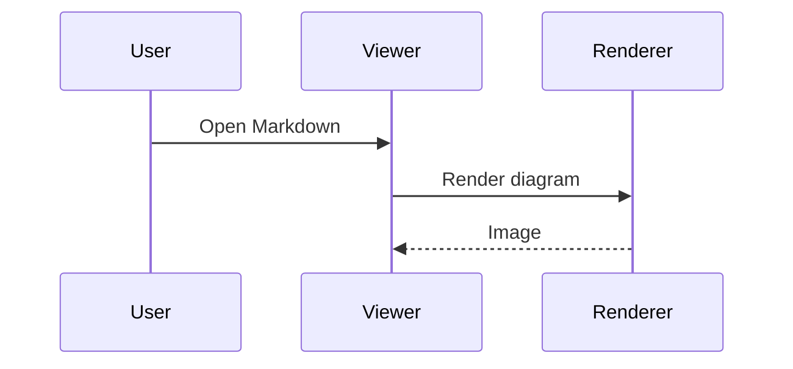

# Mermaid

```mermaid
flowchart LR
    A[Markdown] --> B[GPUI]
    B --> C[画面に表示]
```

```mermaid
sequenceDiagram
    User->>Viewer: Open Markdown
    Viewer->>Renderer: Render diagram
    Renderer-->>Viewer: Image
```

図の後の段落です。
